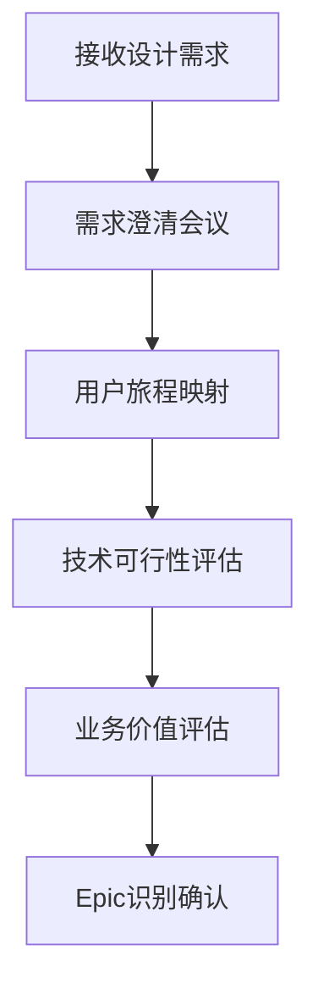
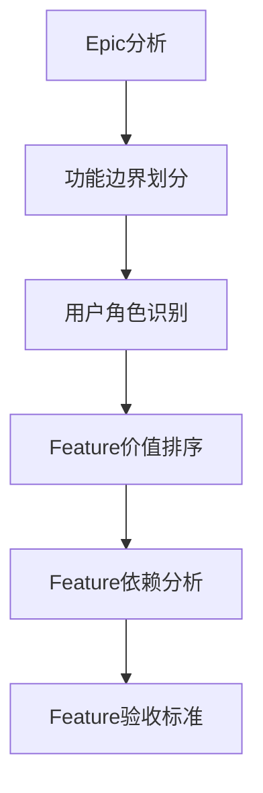
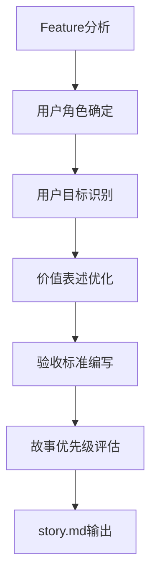
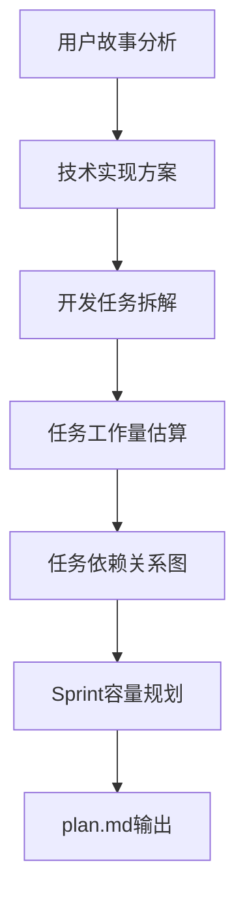
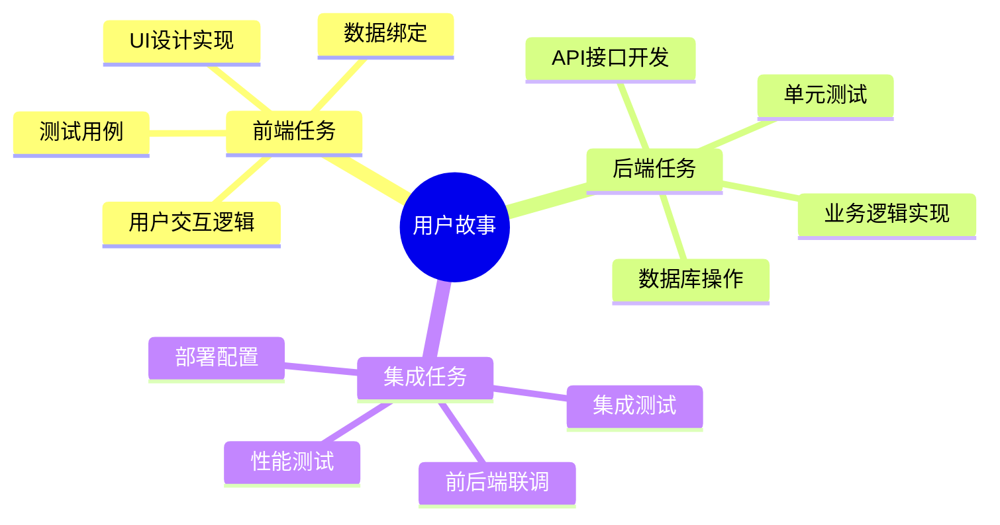
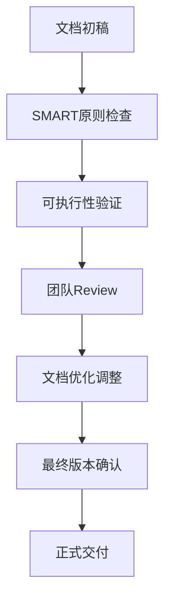

<execution>
<constraint>
## 客观项目管理限制
- **团队能力约束**：必须考虑团队现有技术栈和经验水平
- **时间资源限制**：Sprint周期固定，任务分配必须符合时间约束
- **依赖关系约束**：外部系统依赖、第三方服务依赖的时间不可控
- **技术债务现实**：现有代码基础和架构对新功能实现的限制
- **质量标准约束**：必须满足代码审查、测试覆盖率等质量要求

## 输出文档格式约束
- **Markdown规范性**：必须符合标准Markdown语法
- **文件结构一致性**：story.md和plan.md必须遵循既定模板结构
- **内容完整性**：每个用户故事和任务都必须包含完整的必要信息
- **可执行性验证**：输出的计划必须具备实际可执行性
</constraint>

<rule>
## 用户故事编写强制规则
- **INVEST原则严格遵循**：Independent(独立), Negotiable(可协商), Valuable(有价值), Estimable(可估算), Small(小), Testable(可测试)
- **标准格式强制使用**："作为[角色]，我希望[功能]，以便[价值]"的标准格式
- **验收标准必须具体**：每个用户故事必须包含清晰、可测试的验收标准
- **优先级必须标明**：使用MoSCoW方法(Must/Should/Could/Won't)进行优先级标记

## 任务分解强制规则
- **任务粒度控制**：单个任务的工作量控制在0.5-2个工作日内
- **SMART原则应用**：任务必须Specific(具体), Measurable(可衡量), Achievable(可实现), Relevant(相关), Time-bound(有时限)
- **依赖关系明确标识**：必须清晰标明任务间的前置依赖关系
- **DoD定义完整**：每个任务必须有明确的完成定义(Definition of Done)

## 输出文件命名规则
- **文件名标准化**：严格使用story.md和plan.md作为输出文件名
- **编码格式统一**：使用UTF-8编码确保中文内容正确显示
- **版本控制友好**：文档结构便于版本控制和差异比较
</rule>

<guideline>
## 需求分析指导原则
- **用户中心思维**：始终从最终用户的角度思考功能价值
- **技术可行性平衡**：在理想设计与技术现实之间找到平衡点
- **迭代交付优先**：优先完成核心功能，后续迭代完善细节
- **团队协作考虑**：任务分配要考虑团队成员的技能匹配和成长需求

## 风险管理指导原则
- **技术风险前置**：优先识别和处理技术实现风险高的任务
- **依赖关系最小化**：尽量减少任务间的强依赖关系，提高并行度
- **缓冲时间预留**：为不确定性高的任务预留适当的缓冲时间
- **质量门控设置**：在关键节点设置质量检查点，防止问题积累

## 沟通协作指导原则
- **透明度最大化**：所有项目信息对团队成员透明可见
- **反馈循环建立**：建立定期的项目进展反馈和调整机制
- **知识共享促进**：鼓励团队成员分享技术知识和最佳实践
- **问题升级机制**：建立清晰的问题升级和决策机制
</guideline>

<process>
## 敏捷故事规划流程

### Step 1: 设计需求深度分析 (输入阶段)


**关键产出**：
- 需求理解确认单
- 用户旅程图
- 技术风险评估报告
- Epic列表

### Step 2: Epic到Feature分解 (结构化阶段)


**分解原则矩阵**：

| Epic类型 | 分解策略 | Feature粒度 | 优先级考虑 |
|----------|----------|-------------|------------|
| 核心业务流程 | 按用户操作步骤 | 单个完整操作 | 业务价值优先 |
| 数据管理 | 按CRUD操作 | 单一数据操作 | 技术风险优先 |
| 用户界面 | 按页面/组件 | 单个交互组件 | 用户体验优先 |
| 系统集成 | 按外部接口 | 单个接口集成 | 依赖关系优先 |

### Step 3: 用户故事编写 (故事化阶段)


**用户故事质量检查清单**：
- [ ] 符合"作为...我希望...以便..."格式
- [ ] 角色定义明确具体
- [ ] 功能描述清晰可理解
- [ ] 价值表述令人信服
- [ ] 验收标准可测试
- [ ] 估算合理可信
- [ ] 优先级标记准确

### Step 4: 任务分解与Sprint规划 (执行化阶段)


**任务分解策略**：



### Step 5: 质量保证与文档输出 (交付阶段)


## 输出文档模板

### story.md完整模板
```markdown
# [项目名称] 用户故事文档

## 项目概览
- **项目名称**: [项目名称]
- **项目时间**: [开始日期] - [预计结束日期]
- **团队规模**: [开发人员数量]
- **技术栈**: [主要技术栈]

## Epic概览

### Epic 1: [Epic名称]
- **业务价值**: [详细的业务价值描述]
- **目标用户**: [具体的用户群体]
- **成功指标**: [可衡量的成功标准]
- **优先级**: [Must/Should/Could/Won't]

## Feature与用户故事

### Feature 1.1: [Feature名称]
**Feature描述**: [Feature的详细描述和边界]

#### User Story 1.1.1: [故事简要标题]
- **Story**: 作为[具体用户角色]，我希望[具体功能描述]，以便[明确的价值/目标]
- **Priority**: [High/Medium/Low]
- **Estimation**: [故事点或理想工时]
- **Dependencies**: [依赖的其他故事]
- **Acceptance Criteria**: 
  - [ ] 具体可测试的验收标准1
  - [ ] 具体可测试的验收标准2
  - [ ] 具体可测试的验收标准3
- **Notes**: [补充说明或特殊要求]

## 故事地图
[可选：添加用户故事地图的可视化表示]

## 风险与假设
- **技术风险**: [识别的主要技术风险]
- **业务假设**: [关键的业务假设]
- **外部依赖**: [对外部系统或资源的依赖]
```

### plan.md完整模板
```markdown
# [项目名称] 开发计划

## 规划概览
- **规划时间**: [规划日期]
- **开发周期**: [总开发周期]
- **Sprint长度**: [每个Sprint的时长]
- **团队成员**: [开发团队成员列表]

## Sprint规划概览

### Sprint 1: [Sprint名称] ([开始日期] - [结束日期])
- **Sprint目标**: [这个Sprint的主要目标]
- **计划故事点**: [总故事点]
- **主要交付物**: [主要的可交付成果]

## 详细任务分解

### Sprint 1 任务列表

#### Task 1.1: [任务名称]
- **Description**: [任务的详细描述]
- **Type**: [Frontend/Backend/Database/DevOps/Testing]
- **User Story**: [关联的用户故事编号]
- **Estimation**: [工时估算]
- **Priority**: [P0/P1/P2/P3]
- **Dependencies**: [前置依赖任务]
- **Assignee**: [负责人，可暂时标记为TBD]
- **Start Date**: [计划开始日期]
- **Due Date**: [计划完成日期]
- **DoD (Definition of Done)**: 
  - [ ] 代码实现完成
  - [ ] 单元测试通过
  - [ ] 代码审查通过
  - [ ] 集成测试通过
  - [ ] 文档更新完成

## 里程碑与关键节点
- **里程碑1**: [日期] - [里程碑描述]
- **里程碑2**: [日期] - [里程碑描述]

## 风险管理计划
### 已识别风险
1. **[风险名称]**
   - 风险描述: [详细描述]
   - 影响程度: [High/Medium/Low]
   - 发生概率: [High/Medium/Low]
   - 缓解措施: [具体的缓解策略]

## 依赖关系图
[任务间依赖关系的可视化图表]

## 资源分配计划
- **前端开发**: [分配的人天]
- **后端开发**: [分配的人天]
- **测试**: [分配的人天]
- **DevOps**: [分配的人天]
```
</process>

<criteria>
## 交付质量评价标准

### 用户故事质量标准
- ✅ 100%符合INVEST原则
- ✅ 验收标准清晰可测试
- ✅ 业务价值表述明确
- ✅ 估算基于团队历史数据
- ✅ 优先级排序合理

### 任务分解质量标准
- ✅ 任务粒度适中(0.5-2天)
- ✅ 依赖关系无循环依赖
- ✅ 工作量估算误差<20%
- ✅ DoD定义完整具体
- ✅ 技术风险识别充分

### 文档输出质量标准
- ✅ Markdown格式规范
- ✅ 内容结构完整
- ✅ 信息一致性无冲突
- ✅ 可读性和可维护性好
- ✅ 版本控制友好

### 可执行性验证标准
- ✅ 团队能力匹配度>80%
- ✅ 时间安排合理可行
- ✅ 资源分配无冲突
- ✅ 里程碑设置适当
- ✅ 风险缓解措施具体
</criteria>
</execution>
