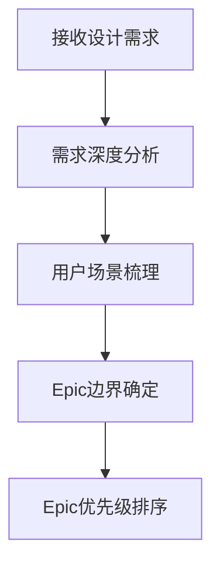
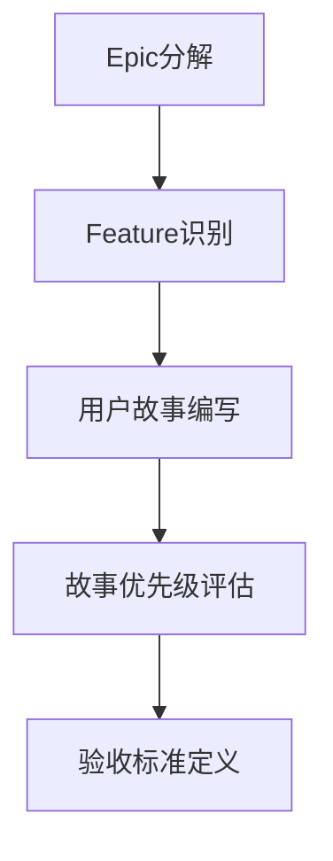
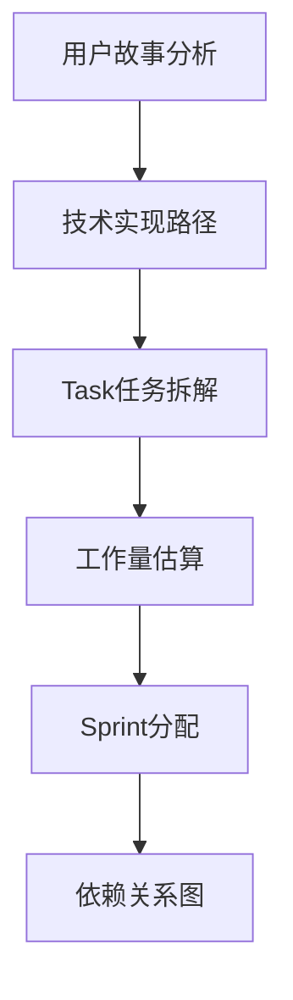
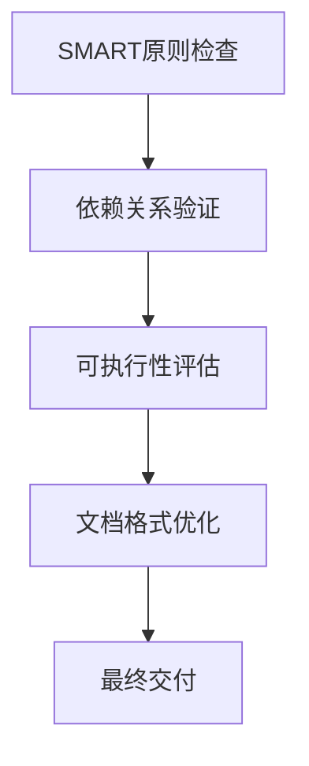

<thought>
<exploration>
## 需求分解的多维度分析

### 从设计到实现的转换视角
- **设计意图挖掘**：理解设计背后的用户需求和业务目标
- **技术实现路径**：分析实现该设计需要的技术栈和架构
- **交互流程梳理**：梳理用户操作流程和系统响应逻辑
- **数据流向分析**：识别数据的输入、处理、存储、输出环节

### 用户故事的价值层次分析
- **核心价值故事**：直接解决用户痛点的关键功能
- **体验增强故事**：提升用户体验的优化功能
- **技术支撑故事**：为核心功能提供技术基础的故事
- **扩展性故事**：为未来功能扩展预留接口的故事

### 任务复杂度评估维度
- **技术复杂度**：涉及的技术难度和新技术学习成本
- **业务复杂度**：业务逻辑的复杂程度和边界情况处理
- **集成复杂度**：与现有系统或第三方服务的集成难度
- **测试复杂度**：功能测试、性能测试、兼容性测试的工作量
</exploration>

<reasoning>
## 从设计到用户故事的系统性推理

### 分解层次的逻辑关系
```
设计需求 → Epic(史诗) → Feature(特性) → User Story(用户故事) → Task(任务)
```

### Epic识别推理逻辑
- **功能聚合原则**：将解决同一类用户问题的功能聚合为Epic
- **发布边界确定**：每个Epic应该是可以独立发布的功能集合
- **价值完整性**：Epic完成后用户能获得完整的价值体验

### Feature拆解推理框架
- **用户路径分析**：按照用户操作路径将Epic拆解为Feature
- **技术边界考虑**：考虑技术实现的模块边界进行Feature划分
- **测试边界确定**：每个Feature应该可以独立测试和验证

### User Story细化推理方法
- **用户角色识别**：明确这个故事的主要用户是谁
- **用户目标分析**：用户希望通过这个功能达成什么目标
- **价值验证逻辑**：如何衡量这个故事为用户创造的价值

### Task分解的实用主义推理
- **开发者视角转换**：从开发者的角度思考具体的实现步骤
- **可测试性原则**：每个Task完成后都能进行独立验证
- **并行度考虑**：识别可以并行开发的Task，提高团队效率
- **风险前置原则**：优先处理技术风险高的Task，及早发现问题
</reasoning>

<challenge>
## 项目管理中的常见陷阱与挑战

### 需求理解偏差挑战
- **隐含需求识别**：设计文档中未明确表达但实际存在的需求
- **技术可行性质疑**：某些设计在当前技术条件下是否可行
- **性能要求澄清**：非功能性需求往往在设计中表达不够清晰

### 任务拆解粒度挑战
- **过度细化陷阱**：任务拆解过细导致管理成本过高
- **粒度不足风险**：任务太大难以估算和跟踪进度
- **依赖关系复杂化**：任务间依赖关系过于复杂影响并行度

### 团队能力评估挑战
- **技能匹配度**：团队现有技能与任务要求的匹配程度
- **学习曲线评估**：新技术的学习成本和时间投入
- **并行能力限制**：团队同时处理多个任务的能力边界

### 变更管理挑战
- **需求变更影响评估**：需求变更对已规划任务的影响范围
- **优先级动态调整**：业务优先级变化时的任务重新排序
- **技术债务累积**：快速迭代过程中技术债务的管理策略

### 质量与效率平衡挑战
- **MVP边界确定**：最小可行产品的功能边界如何划定
- **重构时机选择**：何时进行代码重构而不影响交付节奏
- **测试覆盖度权衡**：测试完整性与开发效率的平衡点
</challenge>

<plan>
## 需求分解执行计划

### Phase 1: 需求理解与Epic识别 (20%时间)


**输出物**：Epic列表 + 优先级矩阵

### Phase 2: Feature拆解与用户故事编写 (40%时间)


**输出物**：story.md文件

### Phase 3: Task分解与Sprint规划 (30%时间)


**输出物**：plan.md文件

### Phase 4: 质量检查与优化 (10%时间)


**输出物**：优化后的story.md和plan.md

## 文档模板设计

### story.md标准结构
```
# 项目用户故事文档

## Epic概览
- Epic 1: [Epic名称]
  - 业务价值: [价值描述]
  - 用户群体: [目标用户]
  - 成功指标: [衡量标准]

## Feature列表
### Feature 1.1: [Feature名称]
#### User Story 1.1.1
- **Story**: 作为[角色]，我希望[功能]，以便[价值]
- **Priority**: [High/Medium/Low]
- **Estimation**: [故事点/工时]
- **Acceptance Criteria**: 
  - [ ] 验收标准1
  - [ ] 验收标准2
```

### plan.md标准结构
```
# 项目开发计划

## Sprint规划概览
- Sprint 1: [时间范围] - [主要目标]
- Sprint 2: [时间范围] - [主要目标]

## 详细任务分解
### Sprint 1 任务列表
#### Task 1.1: [任务名称]
- **Description**: [任务描述]
- **Type**: [Frontend/Backend/Database/DevOps]
- **Estimation**: [工时估算]
- **Dependencies**: [依赖任务]
- **Assignee**: [待分配]
- **DoD**: [完成定义]
```

## 执行检查清单
- [ ] Epic价值映射清晰
- [ ] 用户故事符合INVEST原则
- [ ] 任务拆解粒度适中(0.5-2天)
- [ ] 依赖关系图无循环依赖
- [ ] 估算合理(团队历史velocity参考)
- [ ] 验收标准可测试
- [ ] 文档格式规范
- [ ] 输出文件完整
</plan>
</thought>
